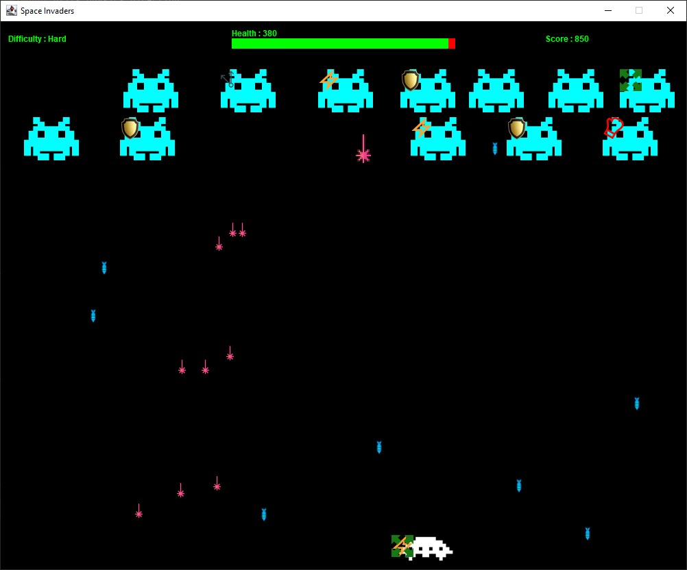
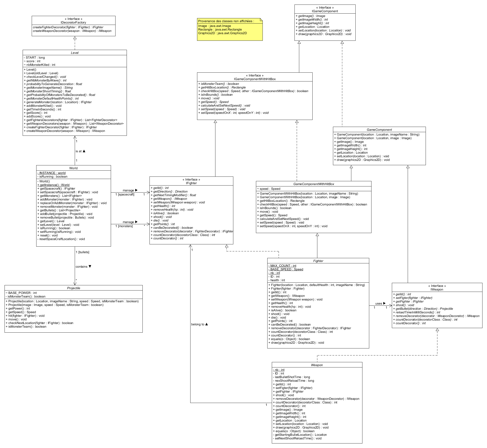
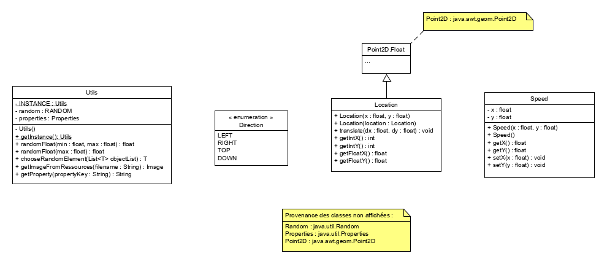

# :computer: MCR - Projet

**Auteurs**: Alexis Allemann, Hakim Balestrieri, Aloïs Christen, Alexandre Mottier, Corentin Zeller

**Date :**  20 mai - 20 juin 2021

**Pattern à étudier :** Décorateur

[TOC]

## :runner: Introduction

Dans le cadre du cours de modèles de conception réutilisables (MCR) de l'[HEIG-VD](https://heig-vd.ch/), nous devons réaliser un projet dans lequel nous devons choisir un modèle de conception et l'étudier. Le modèle qui nous as été attribué est nommé "**Décorateur**". 

Nous avons tout d'abord dû analyser le modèle de conception et réaliser une présentation de ce dernier. La suite du projet consiste à réaliser une application qui le met en œuvre. Notre application est un jeu nommé **Space Invaders**

> Les images et schémas présents dans ce rapport sont également disponibles en annexe

## :rocket: Jouer à Space Invaders

Afin de lancer le jeu, il faut ouvrir le projet avec un éditeur et lancer le programme après l'avoir compilé.

Le but du jeu est de résister le plus longtemps possible face à une invasion de monstres et de réaliser le meilleur score possible. Pour cela, vous possédez un vaisseau spatial avec un niveau de vie. Celui-ci peut se déplacer latéralement et tirer des balles pour tuer les monstres qui l'attaquent.

La difficulté augmente au long de la partie et les monstres deviennent de plus en plus dur à tuer et sont parfois décorés avec des pouvoirs supplémentaires.

Un système de bonus vous permet d'améliorer votre vaisseau. Pour gagner des bonus, il faut tuer des monstres et récupérer les étoiles qui apparaîtront dans le jeu. 

Voici les touches du clavier et leurs actions :

| Touche         | Action                      |
| -------------- | --------------------------- |
| Flèche gauche  | Bouger le vaisseau à gauche |
| Flèche droite  | Bouger le vaisseau à droite |
| Flèche du haut | Tirer une balle             |
| Espace         | Tirer une balle             |
| R              | Recommencer la partie       |
| N              | Recommencer la partie       |

Voici les bonus et leurs actions :

| Image                                     | Bonus                                                        |
| ----------------------------------------- | ------------------------------------------------------------ |
|         | Agrandir les balles                                          |
|        | Faire plus de dégâts                                         |
|  | Augmenter la vitesse des balles                              |
|       | Protéger le vaisseau. Protège d'un certain nombre de hp puis disparait. |
|        | Augmenter la vitesse de déplacement du vaisseau              |
|     | Tirer des balles lasers dans plusieurs directions. Ne dure que quelques secondes. |

Voici une image du gameplay :

### :wrench: Fichier de configuration

Le fichier [config.properties](./src/main/resources/) permet de modifier le comportement du jeu. En modifiant les valeurs dans celui-ci, ils est possible de modifier les différents niveaux, points de vies et paramètres généraux de l'application.

## :factory: Conception du jeu

Pour réaliser le jeu, nous avons décidé de mettre en place une architecture basée sur le modèle de conception <u>MVC</u> (Modèle-Vue-Controlleur). Nous avons choisi d'utiliser un thread responsable de l'affichage de la vue (`ViewManager`) et un thread responsable de la mise à jour de l'état du jeu (`ComponentManager`).

Comme on peut le voir, les différents composants du patron MVC sont tous des <u>Singletons</u>. Cela nous permet de facilement accéder à l'instance et aux méthodes des classes de gestion du jeu.

Il existe plusieurs classes de gestion :

- `ComponentManager` qui gère tous les composants du jeu
- `FighterManager` : qui gère les monstres et le vaisseau
- `ProjectileManager` : qui gère les balles et les bonus
- `ViewManager` : qui gère la vue

Pour gérer des appuis simultanés de touches, nous avons créé une classe `MuliKeyPressListener`.

Voici notre schéma UML principal du jeu :

> Des interfaces ont été créées afin de gérer les composants du jeu. Celles-ci définissent l'ensemble des méthodes que doivent implémenter les classes qui les implémentent et notemment tout ce qui concerne la partie graphique et affichage sur la vue.
>
> Le modèle principal du jeu est la classe `World`. Celle-ci est un Singleton et permet au controlleur ou à la vue de facilement manipuler ou récupérer l'état de la partie.

Finalement, voici les quelques classes utilitaires que nous avons mises en place :

> Ces diférentes classes ont permis de gérer la "phisique" du jeu.
>
> La classe `Utils` est un Singleton et elle a permis de centraliser des fonctions utilitaires appelées à plusieurs endroits dans le code.

## :arrow_heading_up: Gestion des niveaux de jeu

Pour gérer les niveaux de jeu, nous avons mis en place le pattern <u>Etat</u> et le pattern <u>Fabrique</u> qui crée des monstres différents selon le niveau de jeu.

Voici l'implémentation :

> Durant la partie, le niveau augmente en fonction du temps qui passe où selon le nombre de monstres tués. Les paramètres du jeu sont donc modifiés à chaque niveau afin de rendre le jeu de plus en plus difficile.
>
> Les niveaux sont des fabriques car ils génèrent des monstres. En effet, les monstres qui apparaissent dans le jeu sont de plus en plus résistants et contiennent de plus en plus de décorations.

## :books: Mise en œuvre du modèle du pattern Décorateur

Le modèle a été mis en place afin de réaliser les bonus que les monstres et le vaisseau peuvent obtenir.

Les décorations sont disponibles sur les `fighters` et sur les `weapons` :

**Fighters  :**

> Les fighters sont les monstres où le vaisseau spatial. Dans notre jeu, tant les monstres que le vaisseau peuvent être décorés avec des pouvoirs supplémentaires (augmenter le nombre de gun, ajouter un bouclier, augmenter la vitesse de déplacement).

**Weapons :**

> Les armes utilisés par les monstres ou par le vaisseau peuvent aussi être décorés pour modifier le comportement ou ajouter des fonctionnalités.

### :chart_with_upwards_trend: Comportements avancés

Voici les comportements du pattern mis en œuvre :

**Ajout de fonctionnalités : **

- Tirer plusieurs balles avec plusieurs armes

**Modification du comportement :**

- Augmenter la vitesse de la balle
- Augmenter les dégâts d'une balle
- Agrandir la taille d'une balle

**Enlever un décorateur :**

- Limiter le temps du décorateur qui tire des balles laser multiples
- Les boucliers disparaissent lorsqu'ils sont utilisés

**Limiter le nombre de décorateurs d'un type :**

- Limiter les tirs multiples à 1 décoration
- Limiter la vitesse du vaisseau 2 décoration

**Limiter le nombre de décorateur totaux :**

- Nombre de décorateurs max du vaisseau à 3 (paramètre modifiable via fichier de config)

## :end: Conclusion

Ce projet nous a demandé un grand investissement de temps mais nous sommes très satisfaits du résultat. De plus l'apprentissage du modèle **Décorateur** a bien été acquis puisque nous sommes parvenus à utiliser des comportements avancés de ce modèle.

Ce projet nous as également permis de revoir et utiliser d'autres patterns étudiés durant le cours.

Nous tirons donc un bilan très positif de ce projet.

